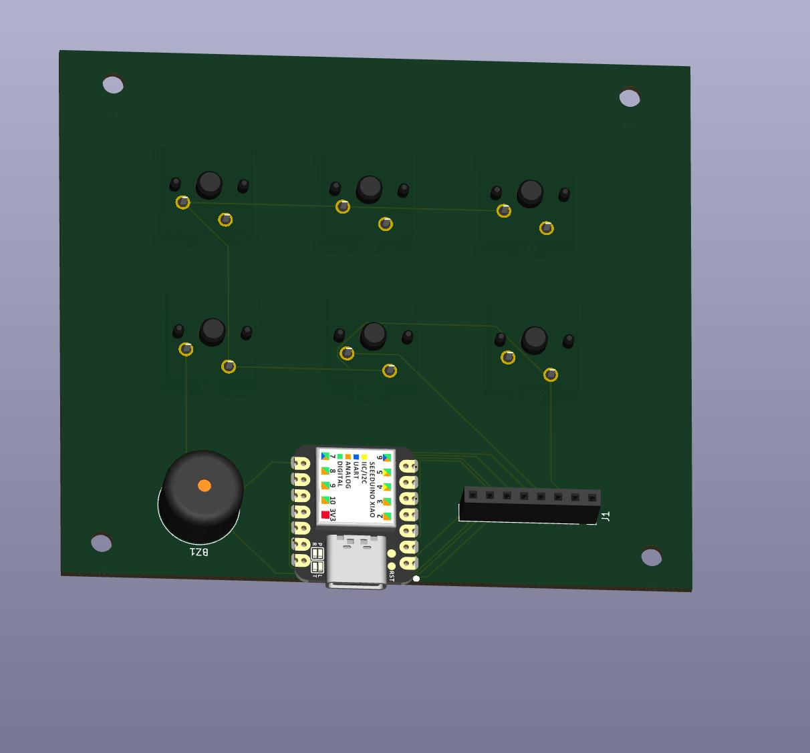
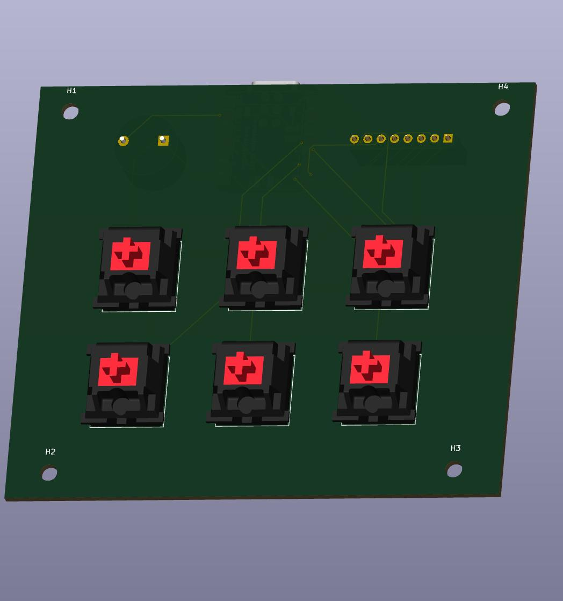
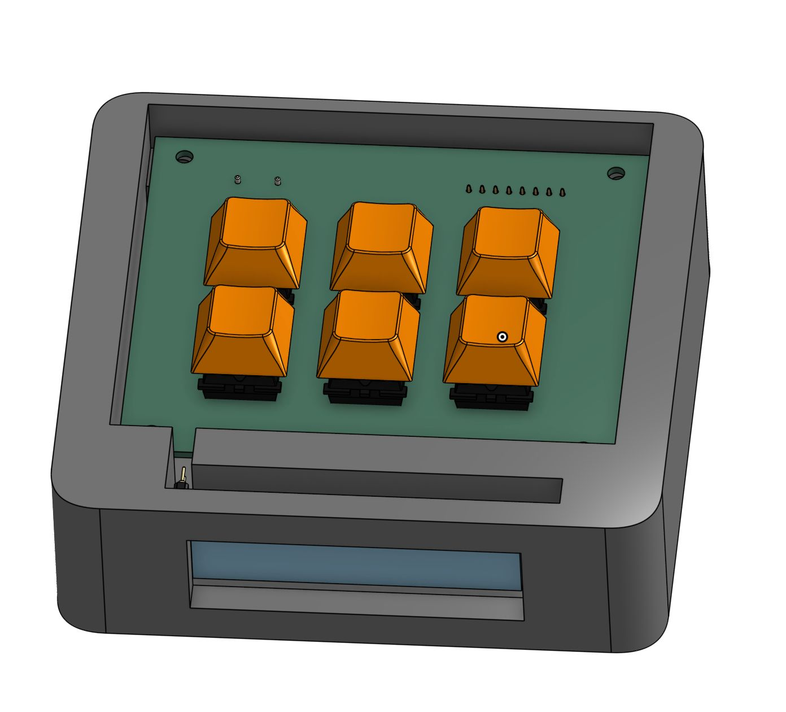
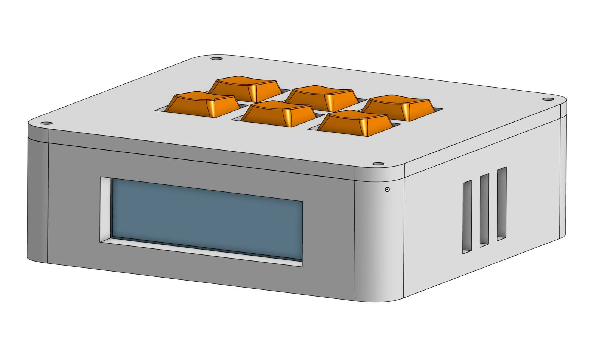

# Blare

## Description

Blare is a custom alarm clock with 6 keys, a buzzer and a TFT display. It has 2 modes, a stopwatch mode and a normal clock mode. A stopwatch mode measures elapsed time from the moment you start it to the moment you stop it. A normal clock time measures the normal time which you can adjust with the 2 specified buttons.

## Features
- 6 mechanical keys
- A buzzer
- TFT Display
- Dual mode (Stopwatch/Clock)
- Adjustable Time

## Bills of Materials
- 1x Seeed XIAO RP2040
- 6x MX-Style Switches
- 6x White Blank DSA keycaps
- 6x through hole 1N4148 Diodes
- 1x 2.25in TFT Screen
- 1x 3.3V Piezo Buzzer
- 1x 2.54mm 8pin Male Header
- 8x 20cm Female-Female Jumper Wires
- 8x M2X5X4 Heatset Inserts
- Top Case 3D Print
- Bottom Case 3D Print

##Images

#PCB

#CAD

